# Book XI: Agent Workflow and Feedback-Loop Atlas

This atlas defines the workflows that make up Hermes, Research Intelligence,
Bulletproof and the execution fleet. Its purpose is to prevent a parent workflow's
coarse status from being mistaken for the state of the work underneath it.

The diagrams are architectural contracts. They show authority, orchestration,
calculation and evidence boundaries; they do not imply that every registered
capability is continuously active.

**Inventory date:** 2026-10-01. The inventory covers every durable recurring control,
research, feedback and recovery loop represented by the checked-in services and
runbooks. One-way registries appear inside the loop that consumes them rather than as
fictional autonomous loops. Live health still requires fresh Mission Control,
heartbeat and receipt evidence.

## Status legend

| Label | Meaning |
| --- | --- |
| `production-active` | A deployed controller or worker runs without a new operator command when its prerequisites exist. |
| `production-conditional` | The path is deployed but runs only after a qualifying input, approval or upstream receipt exists. |
| `operator-triggered` | The path is implemented but starts only from an explicit founder or operator action. |
| `capability-only` | Schemas, producers and APIs exist, but no continuous router sends work through the path. |
| `planned` | The design is recorded but the complete production path is not deployed. |

An immutable registry proves that a contract can be represented. It does not prove
that a controller is invoking it, that compute is active, or that a terminal result
exists.

## Workflow layers and state truth

Hermes is a hierarchy, not one flat state machine:

```mermaid
flowchart LR
    Authority[Authority envelope<br/>mandate or approved plan]
    Orchestrator[Orchestrator<br/>cycle or mission]
    Campaign[Scientific campaign]
    Task[Governed task]
    Allocation[Capacity allocation]
    Native[Native process or engine run]
    Receipt[Immutable evidence receipt]
    Lifecycle[Candidate or operational lifecycle]

    Authority --> Orchestrator --> Campaign --> Task --> Allocation --> Native --> Receipt --> Lifecycle
```

| Layer | What its state answers | What it does not answer |
| --- | --- | --- |
| Mandate | Is this class of bounded work authorized? | Is any task or backtest running? |
| Discovery cycle | Has evidence-to-question orchestration reached a handoff? | What is the nested campaign's current gate? |
| Campaign | Which scientific phase owns the candidate? | Has a worker leased the current task? |
| Task | Is work awaiting approval, queued, leased, running or terminal? | Is the native child healthy unless its heartbeat says so? |
| Capacity allocation | Were CPU and RAM admitted for a native job? | Did the scientific run pass its gates? |
| Native run | Is Bulletproof or another native producer consuming compute? | Has the result been accepted and published? |
| Receipt | What immutable outcome and lineage were retained? | Does the outcome grant shadow, order or capital authority? |
| Lifecycle | Is a candidate proposed, admitted, shadowed, restricted or retired? | How an earlier computation was scheduled. |

The effective state of work is the **deepest nonterminal child**, not the most
convenient parent label:

```text
effective_state = deepest_nonterminal_child(mandate, cycle, campaign, task,
                                             allocation, native_run, receipt)
compute_active  = fresh_task_lease AND fresh_allocation_heartbeat
                  AND living_native_process
blocked_by      = first_unmet_authority_or_scientific_gate
```

For example, a discovery cycle with `phase=campaign` and
`next_action=await_bounded_bulletproof_results` has handed work to a nested campaign.
If that campaign is in `strategy_engineering` and its leaf task is
`pending_approval`, no backtest is running. The correct projection is:

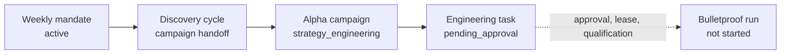

Mission Control should therefore display a breadcrumb and five separate fields:
`lifecycle_state`, `current_leaf`, `blocked_by`, `compute_activity` and
`latest_evidence`. A parent `running` state must never be rendered as an active
backtest without a live allocation and process heartbeat.

## Whole-system map

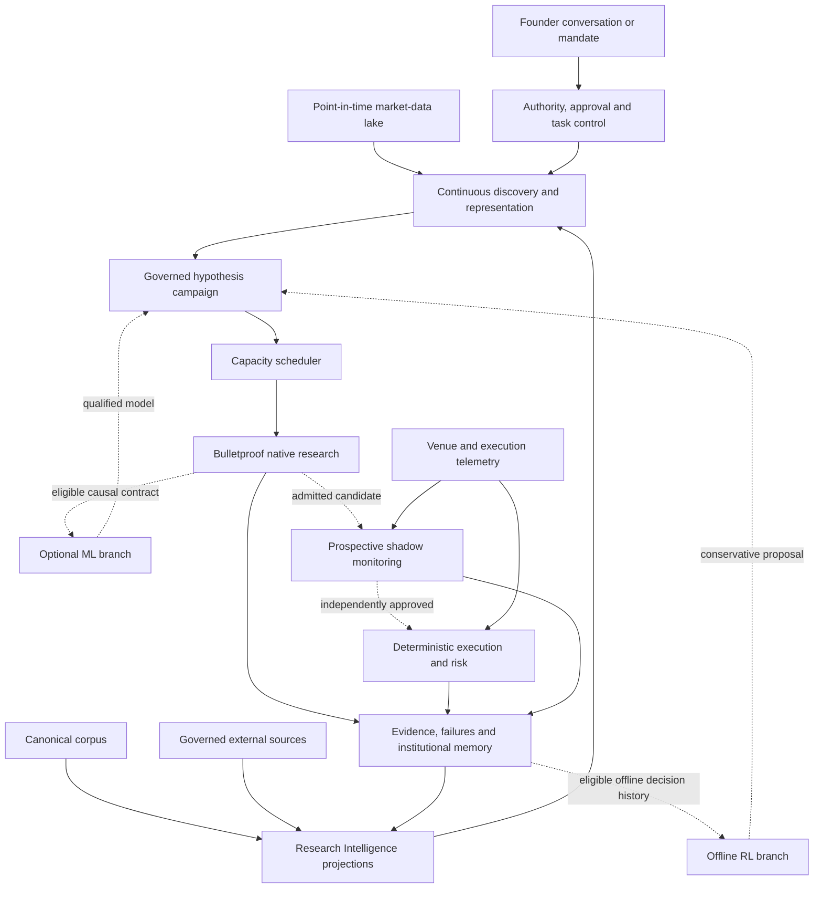

Solid arrows are active data or control relationships. Dotted arrows are conditional
promotion or optional-branch boundaries.

## Control and authority loops

### C1. Founder conversation, proposal and approval

**Status:** `production-active` for intake and explanation;
`production-conditional` for execution.

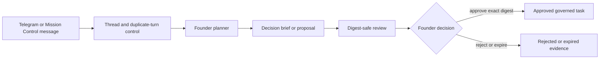

The planner may reason and compile a proposal. It cannot execute the proposal. A
review generation may expire and be resent, but the underlying plan digest remains
the authority boundary. See `ops-006-conversational-founder-intake.md`,
`chan-002-threaded-telegram.md` and `ui-004-digest-safe-approval-center.md`.

### C2. Task lease, attempt and evidence

**Status:** `production-active`.

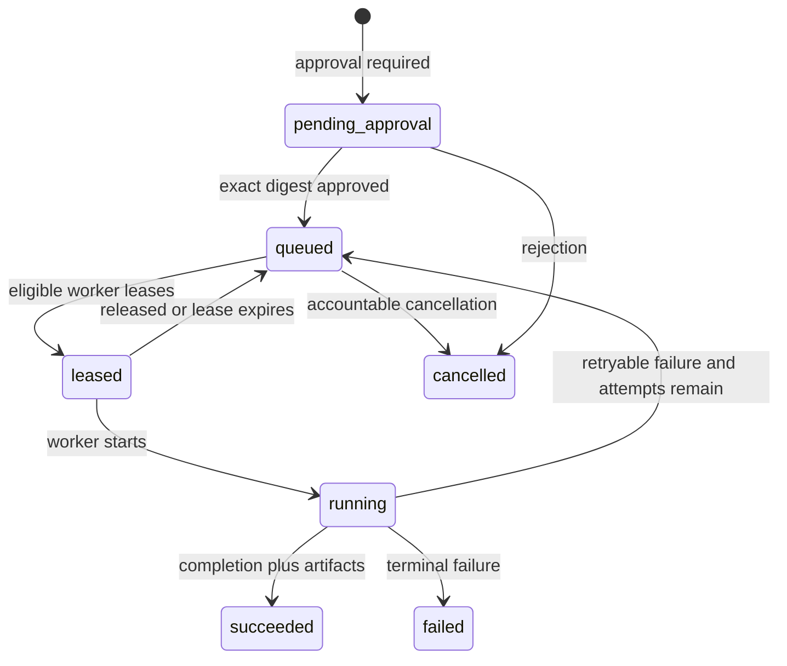

The append-only task-event ledger is authoritative; the task row is a mutable
projection. Approval consumption, lease ownership, attempt number, artifacts and
terminal mutation are atomic boundaries. See `m3-approvals-and-artifacts.md` and
`hermes-swarm-system-design.md`.

### C3. Supervised mission recovery

**Status:** `production-conditional`.

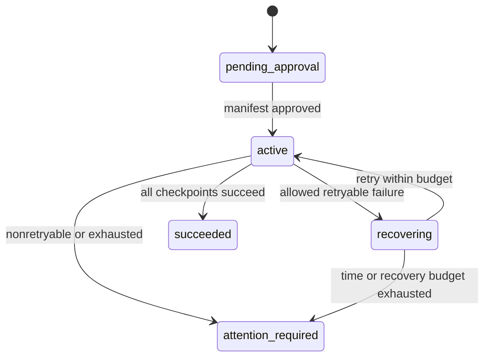

One approved mission may cover its declared checkpoints. Recovery cannot change the
manifest, paths, risk or attempt budget. See `m9-autonomous-mission-supervisor.md`.

### C4. Agent identity, package and presence

**Status:** `production-active`.

A signed role package is bound to an agent, deployment, charter, capability grants
and workload identity. The worker heartbeats its presence, leases only matching work,
and publishes bounded execution state. Revocation or package mismatch stops leasing;
it does not erase prior events. See `agt-001-agent-authority.md`,
`m2-role-packages.md` and `plat-002-workload-identity.md`.

### C5. Typed task graph and compensation

**Status:** `production-conditional`.

An AGT-003 graph freezes node contracts, dependencies, concurrency limits, retry
budgets and compensation edges. The graph controller releases only dependency-ready
tasks. A terminal failure requests declared compensation in reverse dependency order
and retains all original nodes and events. Graph activation does not approve node
work that lies outside its authority envelope. See `agt-003-typed-task-graphs.md` and
`disc-008-bounded-autonomous-research.md`.

## Knowledge and evidence loops

### K1. Canonical ingestion and corpus recovery

**Status:** `production-active` for ordinary ingestion;
`operator-triggered` for exceptional recovery.

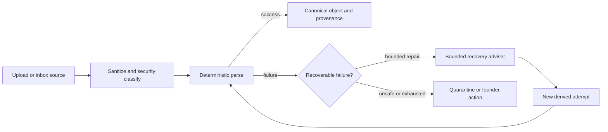

The recovery adviser can recommend a typed action but cannot overwrite canonical
bytes or declare scientific truth. See `ri-005-corpus-recovery.md`,
`ri-007-pdf-recovery.md` and the LLM register.

### K2. Governed external research acquisition

**Status:** `production-active` for the configured allowlisted sources.

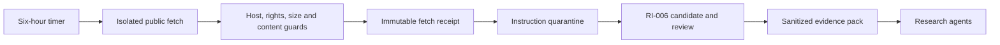

External content is untrusted evidence, not instructions. Social observations may
seed questions but cannot support a scientific, code, promotion or execution claim.
See `ri-006-scientific-surveillance.md` and
`ri-017-governed-external-research.md`.

### K3. Derived-state freshness closure

**Status:** `production-active`.

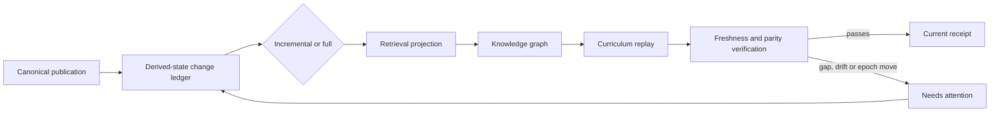

Canonical evidence remains usable while disposable views converge, but agents must
not claim current retrieval or graph state until the receipt closes. See
`ri-016-derived-state-orchestration.md`.

### K4. Scientific representation and just-in-time mathematics assurance

**Status:** `production-conditional`; whole-corpus fidelity remains distinct from
per-equation assurance.

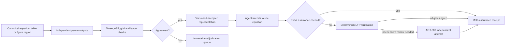

An LLM may locate, transcribe and explain an expression. It cannot verify its own
transcription or make an unqualified representation calculation-authoritative. See
`ri-014-scientific-fidelity.md`.

### K5. Institutional reasoning truth evaluation

**Status:** `operator-triggered`; RI-015 is not made current merely by ordinary
research traffic.

A hidden live-corpus suite invokes the candidate reasoning runtime, an independent
evaluator scores the domain contract, and an immutable manifest records qualified or
not demonstrated. Corpus or projection drift invalidates freshness and requires a
new evaluation. See `ri-015-institutional-intelligence-evaluation.md` and
`ri-015-demonstration-and-equation-assurance.md`.

### K6. Operational memory stewardship

**Status:** `production-conditional`.

Terminal research, operational and correction evidence is summarized into
provenance-bearing memory records. Supersession and retirement are additive; source
receipts remain authoritative. Retrieval of a memory item does not turn it into a
fact, and a later discovery cycle must record the exact consumed digest for the
feedback edge to count as learning. See `m14c-operational-memory-steward.md`.

## Discovery and scientific execution loops

### A1. Founder-supplied hypothesis intake

**Status:** `production-conditional`.

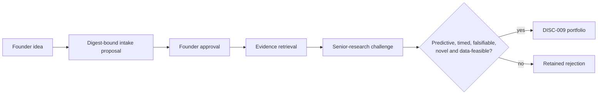

The founder may originate a question without bypassing evidence, representation,
data or independent-review gates. See `alpha-005-founder-hypothesis-intake.md`.

### A2. Continuous evidence-grounded discovery and replenishment

**Status:** `production-active` inside an approved mandate.

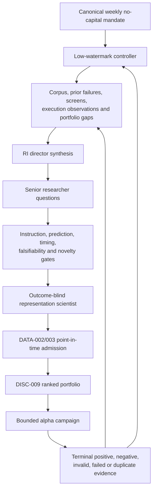

The low-watermark controller starts a new bounded cycle as accepted or awaiting depth
falls below the mandate target and parallel capacity remains. The hourly cadence is a
fallback poll, not the intended response to a duplicate or exhausted queue. A weekly
mandate defines the objective, universes, budgets and no-capital authority envelope;
it does not choose winners or approve new code. See
`alpha-004-continuous-discovery.md` and `disc-009-discovery-portfolio.md`.

### A3. Adaptive representation and selected-panel admission

**Status:** `production-conditional` inside discovery.

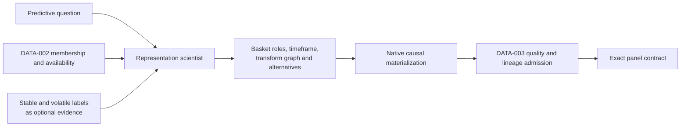

The scientist may select, mix or ignore pre-existing universe labels and may propose
supported complete-bar timeframes and causal transforms. Selection occurs before
outcome access. Native code checks complete bars, point-in-time membership, common
windows, liquidity, gaps, causality and exact file digests. See
`alpha-008-selected-panel-admission.md` and
`alpha-009-adaptive-multi-asset-representation.md`.

### A4. Mechanism, search, falsification and selection-audit services

**Status:** `capability-only` as a collection; individual services run when a
governed campaign explicitly invokes them. They are not an automatic stage of every
ALPHA campaign.

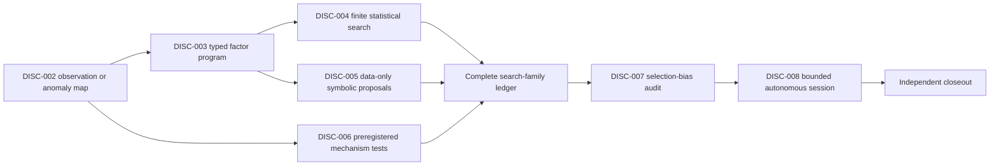

The ladder preserves the difference between observation, anomaly, mechanism and
opportunity. Search proposals cannot execute code or select a production winner;
failed, cancelled and invalid trials consume budget and remain in the family ledger.
Mechanism support cannot override a failed decisive test. See the DISC-002 through
DISC-008 runbooks.

### A5. Governed strategy engineering, review and BT-009 execution

**Status:** `production-conditional`.

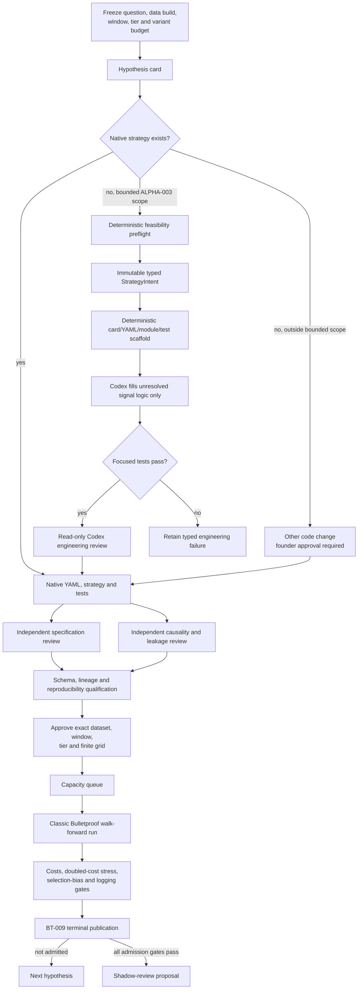

Positive, negative, invalid and failed results are successful retained research
outcomes. Only the classic native engine calculates results. See
`alpha-003-governed-strategy-bridge.md` and
`bt-009-governed-research-bridge.md`.

Feasibility failures terminate before coding tokens are spent. The typed intent freezes
question, target, horizon, causal timing, dataset identities, representation, parameter
budget and authority. Deterministic scaffolding creates the repetitive artifacts;
Codex receives only the unresolved signal, bounded parameters, evaluator, strategy and
focused-test work. It cannot change the intent. A second Codex invocation reviews the
patch read-only, and the complete repository validator remains downstream. A failure
at any stage is retained and cannot consume a BT-009 scientific attempt as though a
backtest had run. The CPU-local author is dormant pending better inference compute.
For cross-asset questions, the declared execution target is always the first canonical
dataset binding; predictors follow in stable admitted order. Producer and worker both
fail closed when that primary identity is absent or ambiguous.

The weekly mandate removes the redundant click only for campaign-director tasks that
implement an admitted hypothesis inside the exact YAML, strategy, test and named
integration allowlist, at risk zero or one and with no capital, order, promotion or
self-approval authority. Existing pending approvals that satisfy the same predicate
are immutably revoked as obsolete and their unchanged tasks are queued. Independent
specification and causality/leakage review still decide whether the bundle can reach
qualification. Ordinary engineering, expanded paths/data, shadow admission and every
capital action remain founder-gated.

### A6. Independent evaluator routing and correction

**Status:** `production-conditional`.

The router binds an exact subject digest to eligible, non-colluding evaluator
profiles. Strategy-spec and causality/leakage assignments are distinct from the
producer identity. Missing, rejected or conflicted receipts block qualification. A
correction creates a successor route or contract; it never rewrites the prior review.
See `agt-006-independent-evaluator-routing.md` and
`alpha-independent-reviewers.md`.

### A7. Capacity, utilization and pre-OOS signal screens

**Status:** `production-active` for scheduling and bounded fallback work.

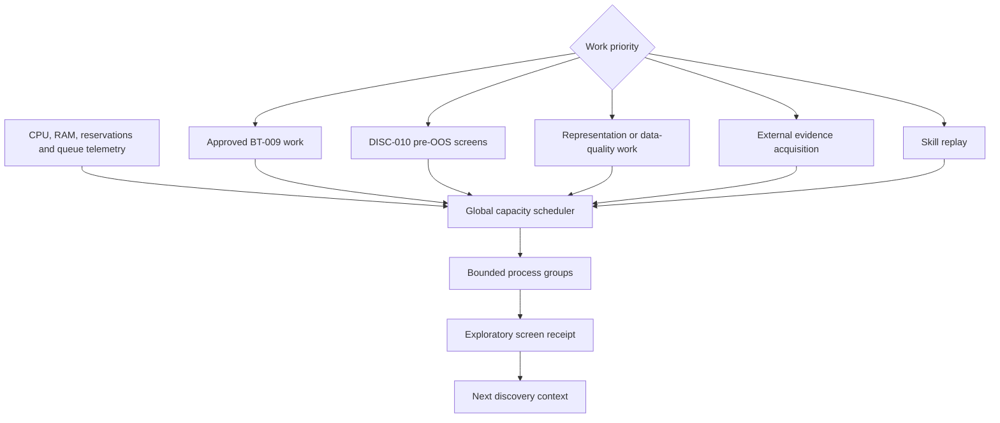

Priority is approved backtests, then screens, representation/data quality, external
evidence and skill replay. An experiment has at most eight preregistered variants;
the scheduler may use fewer workers or admit multiple jobs when measured resources
allow it. A DISC-010 screen uses exploration/training data only. It is not OOS
evidence, a BT-009 outcome or promotion authority. The publisher may feed its receipt
back as a question seed. See `alpha-capacity-governed-execution.md`,
`alpha-010-continuous-utilization.md` and
`disc-010-native-ohlcv-signal-surveillance.md`.

### A8. Outcome memory and novelty feedback

**Status:** `production-active` after a terminal campaign outcome.

BT-009 publishes exact question, representation, dataset, code, window, grid,
metrics, gate outcomes and independent reviews to Bulletproof memory and Hermes.
Negative, invalid, failed and duplicate evidence updates novelty and abductive context
for future discovery. A failure may schedule another question; it cannot be erased or
silently relabeled as a candidate.

## ML and RL branches

### M1. Optional supervised-learning branch

**Status:** `capability-only` until an eligibility router is deployed.

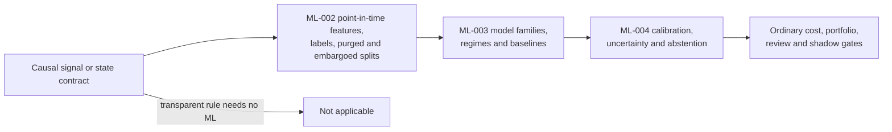

ML does not replace signal discovery or final OOS separation. Train-only transforms,
identical folds and baseline comparison remain mandatory.

### M2. Offline reinforcement-learning branch

**Status:** RL-001/002 are `capability-only`; the RL-003 learned sandbox and automatic
eligibility router are `planned`.

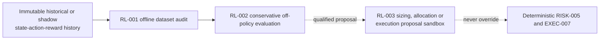

There is no online capital exploration. See `ml-rl-loop-placement.md`.

## Candidate, shadow and live loops

### L0. Orthogonal lifecycle authority

**Status:** `production-conditional`.

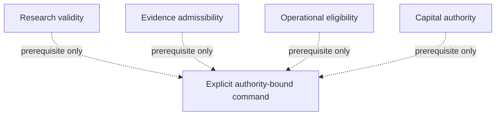

Research, evidence, operations and capital are separate event-sourced dimensions. A
favorable result never changes another dimension automatically. GOV-003 consequences
are additive decisions with explicit rollback and expiry; they are not mutable labels.
See `gov-002-orthogonal-lifecycles.md` and
`gov-003-lifecycle-consequences.md`.

### L1. Portfolio and risk evaluation spine

**Status:** `capability-only` as a complete automatic chain;
`production-conditional` where an admitted candidate explicitly invokes a producer.

```mermaid
flowchart LR
    Candidate[Independently reviewed candidate]
    Portfolio[Dependency, diversification<br/>and construction checks]
    Capacity[PORT-004 turnover, cost,<br/>capacity and liquidity]
    Stress[RISK-001 drawdown, tail<br/>and reverse stress]
    Rules[RISK-002 leverage, margin<br/>liquidation and venue rules]
    Budget[RISK-003 dynamic budget<br/>and regime scaling]
    Admit[RISK-004 lifecycle admission]
    Shadow[Prospective shadow]

    Candidate --> Portfolio --> Capacity --> Stress --> Rules --> Budget --> Admit --> Shadow
```

The native quantitative producers own calculations; Hermes owns schema admission,
authority, lineage and visibility. A conservative fallback or stale-liquidity
abstention remains a valid terminal result. No single favorable receipt grants
allocation, order or capital authority.

### L2. Candidate admission and prospective shadow monitoring

**Status:** `production-conditional`.

```mermaid
flowchart LR
    Result[Terminal independently reviewed BT-009 result]
    Admit[RISK-004 candidate admission]
    Shadow[SHADOW-001 prospective decisions]
    Monitor[SHADOW-002 fills, latency,<br/>drift and restart monitoring]
    Proposal{Lifecycle proposal}
    Continue[Continue shadow]
    Restrict[Demote, restrict, retire<br/>or request promotion]
    Gov[GOV-003 independent authority]

    Result --> Admit --> Shadow --> Monitor --> Proposal
    Proposal --> Continue --> Monitor
    Proposal --> Restrict --> Gov
```

Shadow monitoring emits evidence and proposals. It does not promote, demote,
reactivate, place orders or allocate capital by itself.

### L3. Deterministic order and risk loop

**Status:** `production-conditional`; live capital remains environment- and
candidate-specific authority.

```mermaid
flowchart TB
    Intent[Approved candidate order intent]
    Rules[Current venue identity and rules]
    Risk[RISK-005 fresh deterministic receipt]
    OMS[EXEC-004 idempotent OMS]
    Algo[EXEC-006 scheduler and execution algorithm]
    Adapter[EXEC-008 certified venue adapter]
    Venue[Venue]
    Telemetry[EXEC-011 orders, fills and positions]
    Reconcile[OMS reconciliation]
    Freeze[EXEC-007 freeze or kill]

    Intent --> Risk
    Rules --> Risk
    Risk -->|allow exact state version| OMS --> Algo --> Adapter --> Venue
    Venue --> Telemetry --> Reconcile --> OMS
    Risk -->|deny, stale or conflict| Freeze
    Reconcile -->|ambiguity or mismatch| Freeze
```

A missing or stale risk receipt denies submission. Ambiguous submissions freeze new
exposure until venue and local state reconcile. Demo certification proves operational
behavior, not profitability or live authority.

### L4. Execution degradation and restoration

**Status:** `production-conditional`.

```mermaid
flowchart LR
    Observation[Point-in-time strategy, venue<br/>and infrastructure observations]
    Compare[EXEC-009 threshold comparison]
    Healthy[Continue monitoring]
    Recalibrate[Recalibration review]
    Fallback[Shadow fallback or route restriction]
    Kill[Freeze or kill review]
    Restore[Independent restoration review]

    Observation --> Compare
    Compare -->|healthy| Healthy --> Observation
    Compare -->|single noncritical breach| Recalibrate
    Compare -->|consecutive cost breach| Fallback
    Compare -->|stale, service or rule failure| Kill
    Recalibrate --> Restore
    Fallback --> Restore
    Kill --> Restore
    Restore -->|approved with fresh evidence| Observation
```

Healthy observations after restriction do not reactivate execution automatically.
See `exec-009-execution-degradation.md`.

## Operational assurance loops

### O1. Fleet observation and founder alerting

**Status:** `production-active` where a fleet probe is installed.

Host probes publish bounded CPU, memory, disk, pressure and allowlisted service
health. Three sustained breaches open an incident; three healthy observations recover
it. The independent watcher covers control-plane reachability. Alerts do not perform
remediation. See `ops-004-fleet-observability.md`.

### O2. Codex authentication continuity

**Status:** `production-active` on the shared VM1 Codex runtime.

```mermaid
stateDiagram-v2
    healthy --> suspected: invocation authentication failure
    suspected --> healthy: real minimal probe succeeds
    suspected --> awaiting_login: real probe confirms rejection
    awaiting_login --> awaiting_login: code expires and founder requests new code
    awaiting_login --> validating: device authorization completed
    validating --> healthy: real probe succeeds
    validating --> awaiting_login: provider still rejects session
```

The watcher sends only a verification URL, short-lived code and expiry to Mission
Control and Telegram. It never approves research or spends an experiment attempt.
See `codex-auth-recovery.md` and the companion LLM register.

### O3. Market-data admission and lake incident recovery

**Status:** `production-active` for catalog resolution and admission;
`operator-triggered` for recovery.

DATA-002 resolves an immutable snapshot by instrument, layer, symbol, timeframe,
effective time and knowledge cutoff. DATA-003 checks schema, duplication, gaps,
freshness, entitlement, retention and storage. A material incident disables derived
publication; a new recovery manifest must pass before publication resumes. Source
files and prior evidence are not rewritten. See `data-002-market-data-catalog.md` and
`data-003-lake-operations.md`.

### O4. Audit, backup and disaster recovery

**Status:** `production-active` for scheduled backup/audit components;
`operator-triggered` for restoration drills and incidents.

Immutable events and digests are exported, backups are checked, and restoration uses
the declared recovery sequence. A restore is not successful until canonical evidence,
derived freshness, workload identities and critical services reconcile. See
`gov-004-immutable-audit-export.md`, `ops-003-disaster-recovery.md` and
`ops-005-control-plane-backups.md`.

### O5. Security assurance

**Status:** `operator-triggered` and CI-triggered; non-production-mutating.

The service catalog and threat model drive synthetic hostile tests for prompt
injection, secret exfiltration, privilege escalation, supply-chain tampering and
capital-authority mutation. Any uncovered service, stale threat review or fail-open
fixture fails the suite. A green result proves only the declared controls at that
revision. See `sec-001-security-assurance.md`.

### O6. Runbook-package rehearsal and promotion

**Status:** `production-conditional`.

```mermaid
stateDiagram-v2
    [*] --> draft
    draft --> rehearsed: exact digest passes parity rehearsal
    rehearsed --> approved: accountable digest approval
    approved --> deployed: installation plus post-deploy evidence
```

Changing a package manifest invalidates the chain and requires a new rehearsal.
Declarative runbooks do not grant execution merely because they exist. See
`m10-managed-database-cutover.md`.

### O7. Held-out workflow skill optimization

**Status:** `planned`; the proposal contract exists but production closure is open.

```mermaid
flowchart LR
    Traces[Successful and failed task traces]
    Proposer[Independent skill proposer]
    Candidate[Bounded Markdown diff]
    Replay[Historical replay]
    Holdout[Held-out no-regression gate]
    Stage[Staged for human adoption]
    Reject[Retained negative candidate]

    Traces --> Proposer --> Candidate --> Replay --> Holdout
    Holdout -->|passes| Stage
    Holdout -->|fails| Reject
```

AGT-009 cannot expand tool authority, edit a live package, deploy itself or approve
its own use. Production still requires the immutable registry, independent routing,
package signing, Mission Control review and rollback. See
`agt-009-held-out-skill-optimization.md`.

## Loop catalog

This table is the compact inventory. The detailed diagrams above define the edges and
boundaries.

| ID | Loop | Status | Trigger | Terminal evidence or state |
| --- | --- | --- | --- | --- |
| C1 | Founder conversation and proposal | production-active / production-conditional | Founder message | Decision brief, approval or retained rejection |
| C2 | Task lease and attempt | production-active | Approved or no-approval task | Immutable terminal task event and artifacts |
| C3 | Supervised mission recovery | production-conditional | Approved mission manifest | Succeeded or attention-required mission |
| C4 | Agent package, authority and presence | production-active | Deployment and heartbeat timer | Current presence or revoked/invalid identity |
| C5 | Typed task graph and compensation | production-conditional | Activated frozen graph | Completed graph or retained compensation/escalation |
| K1 | Ingestion and corpus recovery | production-active / operator-triggered | New source or recoverable failure | Canonical object, quarantine or retained failure |
| K2 | External research acquisition | production-active | Six-hour timer | Fetch and RI-006 publication receipts |
| K3 | Derived-state freshness | production-active | Canonical mutation | Current/parity or needs-attention receipt |
| K4 | Scientific representation and JIT math | production-conditional | Scientific region or intended equation use | Representation/adjudication/assurance receipt |
| K5 | Institutional reasoning evaluation | operator-triggered | Hidden-suite evaluation | Qualified or not-demonstrated manifest |
| K6 | Operational memory stewardship | production-conditional | Terminal or corrected evidence | Provenance-bearing memory record |
| A1 | Founder hypothesis intake | production-conditional | Approved founder idea | Portfolio admission or retained rejection |
| A2 | Continuous discovery and replenishment | production-active | Low watermark inside active mandate | Campaign handoff or terminal rejected cycle |
| A3 | Representation and panel admission | production-conditional | Accepted predictive question | Exact DATA-002/003 panel contract |
| A4 | Search, mechanism and bias services | capability-only | Explicit governed laboratory contract | Search ledger, falsification and bias receipts |
| A5 | Strategy engineering and BT-009 | production-conditional | Qualified campaign and approvals | Positive, negative, invalid or failed publication |
| A6 | Independent evaluator routing | production-conditional | Exact review subject digest | Complete, rejected, conflicted or superseded route |
| A7 | Capacity and pre-OOS surveillance | production-active | Queue demand or safe fallback need | Allocation telemetry or exploratory screen receipt |
| A8 | Outcome memory feedback | production-active | Terminal campaign result | Memory publication and later consumption lineage |
| M1 | Supervised ML | capability-only | Eligible causal signal contract | Calibrated/abstaining model or not applicable |
| M2 | Offline RL | capability-only / planned | Eligible immutable decision history | Conservative OPE or abstention |
| L0 | Orthogonal lifecycle authority | production-conditional | Explicit accountable command | Additive lifecycle consequence |
| L1 | Portfolio and risk evaluation | capability-only / production-conditional | Independently reviewed candidate | Admission, fallback or abstention receipts |
| L2 | Candidate and shadow monitoring | production-conditional | Admitted candidate | Continue/restrict/promote-review proposal |
| L3 | Order, risk and reconciliation | production-conditional | Authorized order intent | Fill/reconciliation/freeze evidence |
| L4 | Execution degradation | production-conditional | Fresh execution observations | Monitoring, restriction, fallback or restoration review |
| O1 | Fleet observation and alerting | production-active where installed | Probe timer | Incident transition and founder notification |
| O2 | Codex authentication recovery | production-active on VM1 | Real probe rejection | Healthy session or open recovery incident |
| O3 | Data catalog, admission and recovery | production-active / operator-triggered | Resolution request or lake incident | Admission, disable or recovery manifest |
| O4 | Audit, backup and disaster recovery | production-active / operator-triggered | Schedule or incident | Export, backup or reconciled restore evidence |
| O5 | Security assurance | operator/CI-triggered | Catalog or trust-boundary change | Pass/fail adversarial report |
| O6 | Runbook promotion | production-conditional | New immutable package digest | Draft, rehearsed, approved or deployed record |
| O7 | Held-out skill optimization | planned | Sufficient trace set | Staged or rejected skill candidate |

## Waiting-state interpretation

| Visible state | Meaning | Is compute active? | Required next check |
| --- | --- | --- | --- |
| `awaiting_senior_research_synthesis` | Discovery needs a senior-research result. | Only if its leaf task is leased/running. | Task, agent heartbeat and Codex-auth state. |
| `representation_selection` or awaiting representation | The outcome-blind representation plan is not terminal. | Only if the representation task is leased/running. | Leaf task, catalog inputs and agent heartbeat. |
| `phase=campaign` / `await_bounded_bulletproof_results` | The discovery cycle delegated to a campaign. | Unknown; usually no. | Open the nested campaign and then its current task. |
| `founder_strategy_engineering_approval` | Exact new code work is blocked at approval. | No. | Current approval generation and plan digest. |
| `queued` | Authorized task awaits an eligible worker. | No. | Capability, machine, package and competing leases. |
| `leased` | A worker reserved the task. | Not proven. | Fresh lease/start event and process heartbeat. |
| `running` | Worker reports execution in progress. | Only with fresh allocation and process evidence. | Capacity state, PID/start identity and heartbeat age. |
| `DISC-010 running` | A pre-OOS exploratory screen is consuming compute. | Yes. | Do not call it a full backtest or promotion evidence. |
| `BT-009 running` | A qualified native campaign run is consuming compute. | Yes. | Dataset/window/grid binding and native heartbeat. |
| `needs_attention` | Automatic authority or retry budget is exhausted. | No, unless a child is being cooperatively stopped. | Exact failure category and retained evidence. |
| `schedule_next_discovery_cycle` | The prior attempt is terminal and replenishment is due. | Not necessarily. | Low-watermark controller and successor-cycle receipt. |

## Feedback edges

Every feedback arrow needs a named producer and consumer. Otherwise evidence may be
retained but never influence future work.

| Evidence produced | Canonical consumer | Effect |
| --- | --- | --- |
| Negative, invalid, failed or duplicate BT-009 outcome | ALPHA-004 discovery context and novelty scorer | Penalize repetition, expose contradictions and generate a new question. |
| DISC-010 screen receipt | ALPHA-010 publisher, then next ALPHA-004 cycle | Seed a falsifiable question; never promote directly. |
| External-source receipt | RI-006 admission, then sanitized research context | Add a provenance-bearing observation or literature seed. |
| Representation rejection | Representation context and institutional memory | Avoid invalid baskets/transforms and preserve the reason. |
| Independent-review rejection | Campaign reconciliation and future engineering context | Correct the exact contract or terminate honestly. |
| Shadow deterioration | Candidate lifecycle review | Continue, restrict, demote or retire only through GOV-003. |
| Execution degradation | Calibration, route, shadow or freeze review | Tighten operation without silently changing the strategy. |
| Fleet incident | Founder notification and operations ledger | Alert and require explicit remediation. |
| Corpus mutation | RI-016 derived-state ledger | Rebuild affected retrieval, graph and curricula. |

## Design gaps exposed by the atlas

1. **Parent phases are lossy.** `campaign` and `await_bounded_bulletproof_results`
   describe delegation, not execution. A canonical nested workflow projection should
   return `current_leaf`, `blocked_by`, `compute_activity`, `authority_required`,
   `latest_evidence_digest` and heartbeat age.
2. **Screen capacity can conceal a dry scientific pipeline.** High utilization from
   DISC-010 is useful, but the dashboard must separately count full BT-009 runs,
   screens, engineering tasks and idle-safe fallback work.
3. **Registry completion is not routing.** ML and RL have governed producers but no
   automatic eligibility router. Their cards must say `capability-only`, not active.
4. **Approval inventory needs lineage.** Mission Control should group the current
   approval beneath its campaign and mark superseded, expired and legacy generations
   without mixing them into the actionable count.
5. **Feedback needs consumption receipts.** Retaining a failure is not learning unless
   a later discovery cycle records that it consumed the failure digest.
6. **Authority and science are orthogonal.** Approval authorizes bounded work; it does
   not make data valid, a review independent, a result reproducible or a candidate
   promotable.
7. **Continuous does not mean unconstrained.** Low-watermark replenishment and safe
   fallback utilization operate only inside the mandate, data, compute and risk
   budgets. Exhaustion or a missing gate must remain visible rather than being filled
   with invented work.

## Mission Control workflow contract

The workflow view should use the following canonical shape for every active chain:

```json
{
  "workflow_kind": "alpha_campaign",
  "root_id": "...",
  "lifecycle_state": "running",
  "current_leaf": {
    "kind": "strategy_engineering_task",
    "id": "...",
    "state": "pending_approval"
  },
  "blocked_by": "founder_strategy_engineering_approval",
  "compute_activity": "inactive",
  "authority_required": "approve_exact_plan_digest",
  "latest_evidence_digest": "...",
  "heartbeat_age_seconds": null,
  "children": []
}
```

The `children` array preserves the full breadcrumb from mandate through receipt. The
projection is disposable; immutable events, task records, native receipts and
scientific artifacts remain authoritative.

## Change discipline

When a workflow changes, update this atlas, the owning runbook and the Mission Control
projection in the same change. Mark a path active only after a production receipt
proves its controller, worker and terminal evidence. Marking a milestone complete or
registering a schema is insufficient. Never remove failed or superseded paths from the
diagram without preserving their historical evidence and replacement edge.
