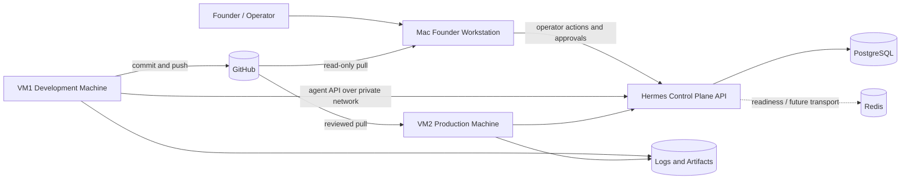
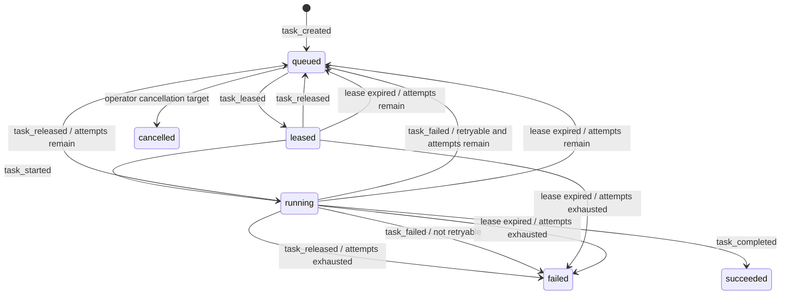
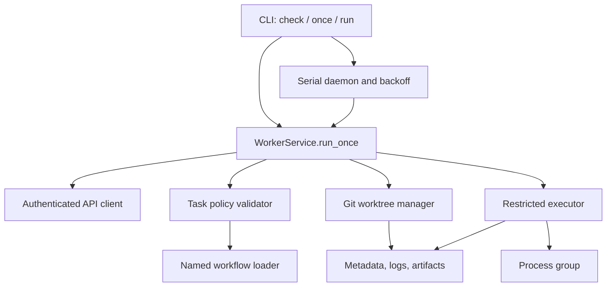

# Hermes Swarm System Design

**Organization:** Invariance Research  
**System:** Hermes Swarm  
**Document status:** Baseline design  
**Design phase:** Phase 1 Foundation  
**Last updated:** 2026-07-30

## 1. Purpose

Hermes Swarm is the distributed operating layer for autonomous work at
Invariance Research. It coordinates specialized software agents through a
central control plane. It is not a general-purpose assistant and does not grant
one agent unrestricted authority.

This document translates the Hermes operating model and PRD into a system
design. It incorporates the Hermes Swarm Development Status Report dated
2026-07-30 and separates:

1. the target architecture across three machines;
2. the Phase 1 behavior implemented and validated in source;
3. infrastructure and operational assets reported as deployed; and
4. capabilities that remain designed but not implemented.

The document is the architectural baseline for subsequent design decisions.
It does not prioritize or schedule future work.

## 2. Design Principles

### 2.1 Bounded specialization

Each agent has one operational role, an explicit capability set, a machine
identity, a risk ceiling, repository constraints, and a workflow allowlist.
New outcomes emerge through orchestration of specialists, not through expanding
one agent into a universal operator.

### 2.2 Workflows over commands

Tasks carry structured intent. They never carry shell programs. A worker maps
an allowlisted workflow name to a reviewed, machine-local definition stored in
source control.

### 2.3 Least privilege by machine

VM1 owns engineering and validation. VM2 owns production runtime and
deployment. The Mac owns founder interaction and approvals. Credentials and
workflows are partitioned so that a worker cannot assume another machine's
authority.

### 2.4 Evidence before autonomy

Every meaningful execution must be attributable to a task, attempt, agent,
machine, workflow, source revision, timestamps, result, logs, and artifacts.
Terminal API payloads remain bounded while full evidence stays in controlled
storage.

### 2.5 Leases, not permanent assignment

Work is temporarily leased to one agent. Lease ownership is proven with a
per-attempt token and expires without heartbeats. A worker that loses its lease
must stop and must not submit a stale terminal result.

### 2.6 Human control of high risk

Production deployment, migrations, credentials, network policy, firewall
changes, and destructive operations require explicit operator approval.
Phase 1 stores approval-policy data but does not yet enforce an approval
workflow; those task classes must therefore remain unavailable to workers.

### 2.7 Git as the software authority

GitHub is the source of truth for software. VM1 authors changes. Reviewed
commits are promoted to VM2 and pulled to the Mac as needed. VM2 and the Mac do
not originate production code, deployment logic, workflows, automation, or
machine configuration.

## 3. System Context



The control plane is logically a VM2 production service. Agents communicate
through its authenticated HTTP API rather than directly with one another.
Tailscale/private-network routing provides reachability but is not a substitute
for application authentication.

### 3.1 Current platform state

The current platform has moved from experimentation into platform engineering.
The following maturity estimates and deployment facts are operator-reported;
source-verified behavior is identified separately throughout this document.

| Machine | Current role | Reported maturity |
| --- | --- | --- |
| VM1 | sole engineering and validation environment | Phase 1 worker validated |
| VM2 | production platform and control-plane runtime | approximately 35-40% of long-term vision |
| Mac | founder command center | approximately 15-20% of long-term vision |

The control plane is operational on VM2. The first restricted VM1 worker has
completed successful and controlled-failure end-to-end pilots against it.

## 4. Machine Architecture

### 4.1 VM1: development and research

VM1 is the authoritative engineering workstation.

**Owned responsibilities**

- source-code development;
- Hermes Core and control-plane feature development;
- infrastructure automation and deployment-tool development;
- Bulletproof BT and Invariance Research development;
- workflow and worker-framework development;
- compilation, linting, tests, and schema validation;
- isolated simulations, experiments, and research workloads;
- future agent and machine-learning framework development;
- generation of engineering documentation, automation, and runbooks.

**Prohibited authority**

- production deployment;
- production database administration;
- production firewall or network changes;
- production credential rotation.

**Phase 1 deployed role**

`vm1-developer-coder` runs the restricted worker framework with capabilities
including Python, Git, and testing. Its validated production workflow is
`code-validation`.

**Current source-verified achievements**

- authenticated worker API client and task lifecycle;
- strict named-workflow and task-contract validation;
- detached Git worktree isolation;
- lease ownership, task heartbeats, and stale-lease handling;
- workspace metadata, logs, and artifact directories;
- Python 3.11 worker runtime and virtualenv-pinned subprocesses;
- structured audit outcomes and protected credential separation;
- hardened systemd service definition;
- successful and controlled-failure Phase 1 pilots.

### 4.2 VM2: production runtime

VM2 is the intended home of the control plane and operational workers.

**Owned responsibilities**

- API, database, Redis, container, and background-service runtime;
- reviewed deployment workflows;
- migrations, health verification, backups, restore tests, and monitoring;
- production logs, metrics, and artifact registration.

**Prohibited authority**

- interactive feature development;
- editing source code outside reviewed Git promotion;
- accepting arbitrary deployment commands from task input.

**Operator-reported deployed foundation**

- Docker runtime;
- PostgreSQL and persistent storage;
- Redis;
- Swarm API container;
- Docker secrets and separated worker credentials;
- health checks;
- Tailscale connectivity;
- production repository and deployment layout;
- artifact directories.

The repository source verifies the control-plane API, database schema, health
interfaces, and authentication behavior. The host deployment topology above is
reported operational state; its complete infrastructure-as-code definition is
not present in this repository snapshot.

**Designed but not implemented as platform capabilities**

- scheduler and recurring jobs;
- task dependencies and multi-worker scheduling;
- dead-letter handling and automatic retry orchestration;
- metrics aggregation, Prometheus, Grafana, tracing, monitoring, and alerting;
- operator dashboard, approval engine, and artifact browser;
- workflow-version registry;
- automated secret rotation, cleanup, backups, rollback, and disaster recovery;
- deployment, infrastructure, operations, monitoring, backup, database,
  security, certificate, and container-lifecycle agents.

### 4.3 Mac: founder command center

The Mac is the human-facing strategy and approval surface.

**Owned responsibilities**

- task initiation and supervision;
- approval and rejection of high-risk work;
- planning, writing, content, business operations, and reporting;
- knowledge access and founder notifications.

**Prohibited authority**

- production hosting;
- production deployment credentials;
- origination of production source changes.

**Operator-reported existing assets**

- Invictus and Shopify operations;
- editorial publishing, content generation, and design;
- research reading and strategic planning;
- company documentation, business communication, and knowledge work.

These are existing founder-workstation capabilities, not yet one integrated
Hermes product surface.

**Designed but not implemented as a unified platform**

- Mission Control and founder dashboard;
- centralized approvals and alerts;
- swarm, worker, research, and deployment visibility;
- unified project and task orchestration views;
- operational knowledge search;
- founder, business operations, knowledge, Invictus, executive reporting,
  planning, presentation, and meeting-preparation agents.

The Mac is an orchestration and decision surface. Its agents must not perform
infrastructure work or receive VM2 production authority.

## 5. Control Plane Design

### 5.1 Responsibilities

The control plane is the system of record for:

- agent registration, identity, credentials, status, and heartbeat presence;
- task creation, eligibility, priority, state, attempts, and terminal outcome;
- atomic lease selection and lease expiry;
- task lifecycle events;
- operator inspection and administrative actions.

The API is intentionally orchestration-centric. Workers execute local
workflows; the control plane does not send executable programs.

### 5.2 Authentication domains

Hermes uses separate credential domains:

| Credential | Holder | Purpose | Storage |
| --- | --- | --- | --- |
| Orchestrator secret | human/operator tooling | administrative agent and task APIs | protected operator environment |
| Agent token | one worker identity | identity, heartbeat, lease, and task lifecycle APIs | machine-local root-owned environment |
| Lease token | one task attempt | start, heartbeat, complete, fail, or release | memory only during execution |
| Agent-token HMAC secret | control plane | digest agent and lease tokens | VM2 secret storage |

Agent and lease tokens use prefixes for lookup and HMAC digests at rest. Raw
agent tokens are returned only when issued or rotated. Raw lease tokens are
returned only to the leasing agent.

### 5.3 Agent API

The implemented worker-facing API provides:

- `GET /v1/agent/me`
- `POST /v1/agent/heartbeat`
- `POST /v1/agent/tasks/lease`
- `POST /v1/agent/tasks/{task_id}/start`
- `POST /v1/agent/tasks/{task_id}/heartbeat`
- `POST /v1/agent/tasks/{task_id}/complete`
- `POST /v1/agent/tasks/{task_id}/fail`
- `POST /v1/agent/tasks/{task_id}/release`

The implemented orchestrator API provides agent registration, listing,
inspection, credential rotation/revocation, task creation/listing/detail, and
expired-lease reaping. M1 adds audited global, machine, and agent pause/resume,
control-event inspection, and authenticated Prometheus metrics.

### 5.4 Task eligibility

A queued task is eligible for an agent only when all applicable constraints
hold:

- the agent is enabled;
- the task type is supported by its local worker;
- every required capability appears in the agent capability set;
- `allowed_machines` is empty or contains the agent machine;
- task risk does not exceed the agent risk ceiling;
- a local workflow exists and permits the requested repository;
- the task input contract passes strict worker validation.

Eligible tasks are selected atomically by descending priority and ascending
creation time using row locking with `SKIP LOCKED`.

## 6. Task and Event Model

### 6.1 Task contract

The implemented Phase 1 worker accepts this exact input shape:

```json
{
  "repository": "swarm-control-plane",
  "workflow": "code-validation",
  "base_ref": "main"
}
```

Commands, environment variables, workflow paths, remotes, and credential
references are invalid task input.

Control-plane task policy additionally carries:

- `required_capabilities`;
- `allowed_machines`;
- `risk_level`;
- `max_attempts`;
- `expected_outputs`;
- `acceptance_criteria`;
- `approval_policy`.

### 6.2 State machine



`cancelled` exists in the schema but no cancellation endpoint is implemented in
the current source.

### 6.3 Lease invariants

- Every lease increments `attempt_count`.
- A raw lease token authorizes only its task and current attempt.
- Start requires leased state.
- Execution heartbeat and completion require running state.
- Failure may occur from leased or running state.
- The API permits release from leased or running state; the Phase 1 VM1 service
  uses it only before start for policy rejection.
- Lease heartbeat extends expiry within configured bounds.
- Lease expiry or ownership conflict invalidates subsequent worker mutations.
- Clearing a lease removes assignment and lease-token state from the task.
- Terminal attribution remains in immutable events after assignment is cleared.

### 6.4 Immutable evidence

`task_events` is append-only at the database layer: PostgreSQL rejects update
and delete operations through a trigger. Each event records task, optional
agent, event type, attempt number, message, payload, and creation time.

Task rows remain mutable state projections. Event rows are the authoritative
history for lifecycle attribution.

## 7. VM1 Worker Design

### 7.1 Components



### 7.2 Single-cycle orchestration

`WorkerService.run_once()` executes one serialized lifecycle:

1. load and validate configuration;
2. retrieve and verify agent identity;
3. send idle/online agent heartbeat;
4. request one task lease;
5. return cleanly when no task is available;
6. validate task, machine, capability, risk, repository, and workflow policy;
7. release unsupported work before start;
8. prepare the isolated worktree;
9. start the task with its lease token;
10. execute the named local workflow and send task heartbeats;
11. complete exactly once on success;
12. fail exactly once on execution failure;
13. suppress terminal mutation after lease loss.

### 7.3 Continuous daemon

The daemon calls `run_once()` without overlap and processes one task at a time.
It polls when idle, maintains presence heartbeats, applies bounded exponential
backoff with jitter to connection/server failures, and exits on authentication
or configuration failure. SIGINT and SIGTERM stop new leasing and cancel active
execution through the executor's process-group termination path.

### 7.4 Named workflow policy

Workflow YAML is loaded only from `SWARM_WORKFLOW_DIRECTORY` through a
hard-coded name-to-file allowlist. Pydantic rejects unknown or malformed
fields. Executables are limited to narrow Python, pytest, and read-only Git
operations. Commands are argument arrays and never use a shell.

Phase 1 permits:

```yaml
name: code-validation
task_type: code_validation
timeout_seconds: 900
allowed_repositories:
- swarm-control-plane
- bulletproof_bt
- invariance_research
steps:
- name: compile-python
  command: [python3, -m, compileall, -q, .]
- name: run-tests
  command: [pytest, -q]
```

The policy rejects privilege escalation, shell interpreters, shell
metacharacters, path traversal, absolute executables, destructive filesystem
commands, package installation, service management, network/firewall tools,
secret-reading tools, Git push, remote mutation, credential commands, global
Git configuration, and workflow-managed worktree operations.

### 7.5 Workspace isolation

Source repositories must be direct children of `SWARM_REPOSITORY_ROOT`.
Repository names, resolved paths, symlinks, Git state, base references, and
workspace containment are validated before mutation.

Each task attempt receives:

```text
<workspace-root>/
  <safe-task-number>-<task-uuid>/
    attempt-<n>/
      repository/
      logs/
      artifacts/
      metadata.json
```

The repository directory is a detached Git worktree at the resolved base
commit. The primary checkout is never a workflow working directory. Workspace
reuse requires valid metadata proving the same task and attempt.

Metadata records task identity, attempt, repository, source and workspace
paths, base ref, resolved commit, and creation time. Workspaces are retained
after success and failure in Phase 1.

### 7.6 Process isolation

Workflow subprocesses:

- run as the unprivileged worker user;
- use `exec` argument arrays with no shell;
- run inside the isolated repository;
- start in their own process group;
- receive per-step and overall deadlines;
- receive SIGTERM, a bounded grace period, then SIGKILL if necessary;
- inherit a minimal environment without agent or lease credentials;
- discard ambient `PYTHONPATH`;
- resolve Python and pytest from the worker virtual environment;
- receive fixed synthetic test settings from mode-`0600` artifact files.

Complete stdout and stderr are written to mode-`0600` log files. API results
contain bounded step metadata and relative paths, not unbounded log bodies.

## 8. Data Design

### 8.1 Implemented tables

**agents**

Identity, machine, role, profile, runtime, capability list, risk ceiling,
enabled state, status, heartbeat metadata, and timestamps.

**agent_credentials**

Agent relationship, unique token prefix, token digest, issuance/use/expiry, and
revocation timestamps.

**tasks**

Structured request, policy constraints, assignment, status, priority, risk,
attempt/lease state, result/failure projections, and lifecycle timestamps.

**task_events**

Append-only attempt-aware lifecycle evidence.

**control_scopes**

Current global, machine, and agent pause projections with operator reason and
attribution.

**control_events**

Append-only pause/resume history.

**role_packages / package_deployments**

Immutable signed package manifests and the active/revoked agent deployment
inventory.

**task_approvals / approval_events**

Task-bound plan digests, approval projections, digest-only nonces, expiry and
consumption state, and append-only decision history.

**artifacts**

Immutable evidence manifests containing producer, attempt, workflow version,
source commit, size, digest, storage URI, confidentiality, and retention.

**engineering_missions / mission_events / task_dependencies**

Signed milestone manifests, budgets and deadlines, mission state, and
append-only transitions plus dependency edges used by lease eligibility.

### 8.2 Designed but absent persistence

Recurring schedules, dead-letter queues, generalized concurrency locks,
object-storage upload state, and cross-machine trace correlation remain
unimplemented.

## 9. Security Architecture

### 9.1 Trust boundaries

1. **Operator boundary:** administrative credentials can create tasks and
   manage agents; they must never enter worker environments.
2. **Control-plane boundary:** the API validates credentials, policy metadata,
   state, and lease ownership.
3. **Worker boundary:** task data is untrusted until local contract and workflow
   policy validation succeeds.
4. **Repository boundary:** checked-out source may be hostile; it receives no
   worker credential and runs only inside an isolated worktree.
5. **Machine boundary:** each machine receives only its own identities,
   secrets, repositories, and workflow definitions.

### 9.2 Secret placement

```text
VM1 agent:       /etc/invariance-swarm/vm1-worker.env
VM1 operator:    /etc/invariance-swarm/pilot-operator.env
VM2 runtime:     /run/secrets/*
Repository:      no secrets
Task input:      no secrets
Workflow YAML:   no secrets
```

Files are root-owned and mode `0600`. Secrets are not passed as command-line
arguments. Logging redacts known token formats, bearer values, Authorization
headers, and configured secret values.

### 9.3 Systemd containment

The VM1 service runs as `omenka` with:

- no capabilities or privilege escalation;
- `UMask=0077`;
- a read-only system and home;
- explicit writable paths only for workspace and Git worktree metadata;
- private temporary and device views;
- kernel, control-group, clock, hostname, SUID/SGID, realtime, and personality
  restrictions;
- address families restricted to Unix, IPv4, and IPv6;
- bounded stop timeout and control-group termination;
- journald output.

This is strong process containment but not a container or virtual-machine
security boundary. Workflow network egress is not restricted in Phase 1.

## 10. Audit and Observability

### 10.1 Evidence layers

| Layer | Evidence |
| --- | --- |
| Control plane | task projection, immutable events, agent heartbeats |
| Worker API result | workflow, repository, commit, attempt, timings, return codes, relative logs |
| Workspace | metadata, complete stdout/stderr, synthetic test files, artifacts |
| Service | redacted structured journald events |
| Git | reviewed source and workflow definitions |

The successful VM1 pilot proved task creation, lease, start, heartbeats,
completion, failure, event order, attempt count, correct agent attribution,
bounded results, retained evidence, source-checkout isolation, and absence of
credential patterns.

### 10.2 Current gaps

- no centralized artifact upload backend;
- no dashboard or founder notification channel;
- no cross-machine correlation view beyond task and event queries.

M1 provides a protected Prometheus endpoint, baseline alert rules, worker
version in heartbeat and terminal evidence, audited pause controls, and a
terminal-state-aware retention tool. M2-M4 add signed role packages, deployment
attestation, approval and artifact evidence, and bounded engineering missions.
Alert routing, object storage, and a founder-facing dashboard remain product
work.

## 11. Source Promotion and Operations

The intended promotion path is:

```text
Idea
  -> design
  -> VM1 implementation
  -> tests and restricted validation
  -> commit and push
  -> review and merge
  -> VM2 pull of reviewed commit
  -> approved deployment workflow
  -> verification and observation
  -> Mac pull for founder-facing use
```

This is a one-way software-authoring boundary:

```text
VM1 creates -> GitHub records -> VM2 and Mac consume
```

VM2 may produce runtime evidence, operational state, backups, and artifacts.
The Mac may produce operator decisions, business content, and approvals.
Neither machine produces unreviewed Hermes source or deployment automation.

Phase 1 still contains bootstrap exceptions: an operator creates pilot tasks
with a protected script and installs/starts the VM1 systemd unit manually.
These are supervised provisioning actions, not task-supplied execution. The
target architecture replaces recurring production actions with approved,
audited workflows.

Rollback uses reviewed Git revisions and service restart. Credentials,
workspaces, logs, and repositories are preserved by worker uninstall tooling.

## 12. Capability Map

| Capability | Target owner | Phase 1 status |
| --- | --- | --- |
| Agent registry and credentials | VM2 control plane | Implemented |
| Heartbeats and presence | VM2 control plane | Implemented |
| Task creation and inspection | VM2 control plane | Implemented |
| Task priority field and queue ordering | VM2 control plane | Implemented |
| Atomic leases, expiry reaping, and bounded attempts | VM2 control plane | Implemented |
| Append-only task events | VM2 PostgreSQL | Implemented |
| Audited global/machine/agent pause | VM2 control plane | Implemented in M1 source |
| Protected Prometheus metrics and baseline alerts | VM2 control plane | Implemented in M1 source |
| Docker, PostgreSQL, Redis, secrets, and persistent runtime | VM2 | Operator-reported deployed |
| Restricted code validation | VM1 validation worker | Implemented and piloted |
| Continuous VM1 service | VM1 systemd | Built and validated; operator activation is separate |
| Terminal-aware workspace retention tool | VM1 | Implemented in M1 source |
| Control-plane backup and restore-drill runbook | VM2 operations | Implemented in M1 source |
| Signed role packages and deployment attestation | VM2/VM1 | Implemented in M2 source |
| Approval enforcement and immutable decision events | VM2 plus operator | Implemented in M3 source |
| Artifact evidence catalog | VM2 control plane | Implemented in M3 source; object storage pending |
| Engineering mission DAG and dependency scheduling | VM2/VM1 | Implemented in M4 source |
| Isolated coding, validation, review, and PR bundle | VM1 | Implemented in M4 source; supervised pilot pending |
| Recurring jobs and dead-letter queue | VM2 control plane | Designed, not implemented |
| General automatic retry orchestration | VM2 control plane | Bounded M4 task retry only |
| Deployment worker | VM2 | Designed, not implemented |
| Backup/restore worker | VM2 | Designed, not implemented |
| Research and experiment workers | VM1 | Designed, not implemented |
| Founder/business/content workers | Mac | Designed, not implemented |
| Dashboard and Telegram interface | Mac/VM2 | Designed, not implemented |
| Redis queue/event transport | VM2 | Dependency/readiness only |

## 13. Development Ownership and Delivery Sequence

### 13.1 VM1-only authorship

All Hermes engineering work originates on VM1, including:

- Hermes Core and worker framework;
- workflow engine and control-plane features;
- research frameworks, Bulletproof BT, and Invariance Research;
- infrastructure automation, deployment tooling, and runbooks;
- documentation, tests, future ML components, and agent framework.

VM2 is optimized for reliable execution: execute, coordinate, protect, monitor,
deploy, and recover. The Mac is optimized for founder control: observe,
approve, direct, plan, publish, and decide.

This ownership rule applies to human work and agent work. A VM2 operational
agent may execute a deployment workflow developed on VM1, but it may not invent
or edit that workflow locally.

### 13.2 Role delivery unit

Hermes grows platform-first. A new specialized role is delivered as a reviewed
package containing:

1. task type and structured input/output contracts;
2. named workflow definitions;
3. capability profile;
4. permission and risk profile;
5. repository and machine allowlists;
6. executor implementation where existing executors are insufficient;
7. tests, evidence schema, runbook, and rollback behavior;
8. machine configuration that selects the package without changing core
   architecture.

This makes role introduction a configuration and packaging operation rather
than a new trust model.

### 13.3 Declared roadmap order

The development status report establishes this sequence. All stages are
authored and validated on VM1.

| Priority | Platform increment | Scope |
| --- | --- | --- |
| 1 | Worker framework expansion | roles, capabilities, permission profiles, registration, discovery, scheduling interfaces |
| 2 | Control-plane expansion | scheduler, capability matching, approvals, artifacts, metrics, retry engine, operator API |
| 3 | VM2 production agents | deployment, infrastructure, operations, monitoring, backup |
| 4 | Mac control center | Mission Control, approvals, knowledge, research/deployment views, executive reporting |
| 5 | Research swarm | hypothesis, experiments, Bulletproof, features, bias audit, portfolio, regimes, shadow trading, attribution |
| 6 | Business swarm | documentation, proposals, meetings, knowledge base, client operations, automation |

The ordering expresses architectural dependency, not permission to bypass the
design, review, validation, and Git promotion path.

## 14. Nonfunctional Requirements

### Security

- No task-originated arbitrary command execution.
- No cross-machine credential sharing.
- No production authority on VM1 or Mac.
- No source mutation on VM2.
- Fail closed on unknown policy or lost lease.

### Reliability

- Atomic single-owner leasing.
- Expiring leases with heartbeat renewal.
- Bounded retries and attempt counts.
- Process-group cleanup on failure or shutdown.
- Idempotency must be proven before any lifecycle call receives automatic
  retries.

### Reproducibility

- Named, version-controlled workflows.
- Explicit repository and base reference.
- Recorded resolved commit.
- Isolated per-attempt workspaces.
- Versioned worker environments and dependency declarations.

### Auditability

- Append-only lifecycle events.
- Structured terminal outcomes.
- Complete local logs with bounded API summaries.
- Operator and agent attribution.
- Defined evidence retention and artifact registration in later phases.

### Operability

- Non-leasing health check.
- One-shot execution for controlled validation.
- Structured logs and meaningful exit codes.
- Graceful shutdown and supervised daemon activation.
- Documented install, token rotation, rollback, and uninstall paths.

## 15. Architectural Decisions and Open Decisions

### Established decisions

- Central orchestration with no direct agent-to-agent execution channel.
- PostgreSQL is the task and audit authority.
- HTTP bearer authentication separates orchestrator, agent, and lease scopes.
- Tasks reference named local workflows and structured contracts.
- Machine, capability, and risk policy are enforced at lease and worker layers.
- Git worktrees isolate repository execution on VM1.
- Phase 1 concurrency is one task per worker.
- Completed and failed workspaces remain available for audit.
- VM1 is the sole source-authoring environment.
- VM2 and Mac receive Hermes software only through reviewed Git promotion.
- Platform primitives precede expansion of the specialist-agent catalog.

### Open decisions

- artifact storage backend, content addressing, integrity checks, and retention;
- approval-state model, signatures, expiry, quorum, and revocation;
- workflow version identity and promotion across machines;
- worker build/version attestation in task evidence;
- VM2 deployment isolation technology and rollback contract;
- Mac operator interface and notification transport;
- Redis's eventual role versus PostgreSQL-only leasing;
- network-egress policy for research, validation, and deployment workers;
- workspace retention, archival, and secure deletion;
- multi-agent dependency graphs and parent/child task semantics;
- disaster recovery objectives for control-plane state and evidence.

These remain design decisions. They are not implicitly delegated to a worker
or inferred from the current Phase 1 implementation.

## 16. Success Conditions

Hermes satisfies its design when:

- every task is reproducible from reviewed inputs and source;
- every agent operates within explicit machine and capability boundaries;
- every state transition and high-risk approval is attributable and immutable;
- every deployment originates from reviewed Git history;
- VM1 remains the engineering authority;
- VM2 remains the production runtime;
- the Mac remains the founder supervision surface;
- infrastructure can be rebuilt from repositories, secrets procedures, and
  documented workflows;
- specialist agents can be introduced without weakening existing trust
  boundaries or turning task input into executable authority.
